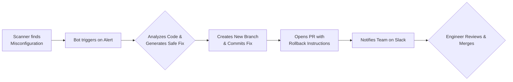

IaC Auto-Remediation Bot 🤖
[](LICENSE)
[](https://www.python.org/downloads/)
[](CONTRIBUTING.md)

From Security Alert to Secure Fix in a Pull Request. Automatically.

The IaC Auto-Remediation Bot transforms infrastructure-as-code (IaC) security misconfigurations into automatically generated, validated, and ready-to-merge pull requests. Stop just flagging problems; start fixing them autonomously with safe, compliant code patches.

🚀 The Problem & Our Solution
The Problem: Traditional IaC security scanners (like Checkov, Terrascan, tfsec) are great at finding problems but leave the tedious and error-prone work of fixing them to already-busy engineers. This creates alert fatigue and increases mean-time-to-remediation (MTTR).

Our Solution: This bot listens to security alerts, diagnoses the misconfiguration, and proactively generates a tested PR with the exact code change needed to fix it. It includes a rollback plan, secret scanning, and integrates into your Slack/Teams workflows for seamless approval.

Result: Your infrastructure gets safer, faster, and your developers are freed from repetitive security toil.

✨ Features
🔧 Multi-IaC Support: Automatically fixes misconfigurations in Terraform, Pulumi, Ansible, and Kubernetes manifests.

🧠 Intelligent Fix Generation: Applies security-best-practice fixes (e.g., changing S3 ACLs from public-read to private and adding block_public_acls).

⏪ Built-in Rollback Plans: Every auto-generated PR includes a clear rollback strategy. A revert PR can be auto-generated with a single comment.

🔐 Secure by Design: All commits are automatically scanned for secrets before push. Integrates with Git hooks and pre-commit frameworks.

🤖 DevOps Workflow Integration: Creates PRs, posts notifications to Slack/Microsoft Teams, and waits for human approval—fitting perfectly into your existing CI/CD governance.

📜 Audit Trail: Logs every action—from alert to fix to merge—for compliance and debugging.

## 🎯 Business Strategy with Dual Licensing

This project employs a dual-licensing model to foster community growth while ensuring a sustainable path for enterprise-grade features and support.

### Open Source (Apache 2.0) Benefits:
*   **Community Growth**: Developers can use and contribute freely, fostering innovation.
*   **GitHub Visibility**: Enhances discoverability and adoption within the open-source ecosystem.
*   **Enterprise Evaluation**: Companies can evaluate the core platform before committing to commercial solutions.
*   **Ecosystem Building**: Encourages integrations and extensions by the community.

### Commercial License Benefits:
*   **Revenue Stream**: Provides a sustainable business model through enterprise subscriptions and services.
*   **Advanced Features**: Allows for the development of proprietary features tailored for large organizations.
*   **Professional Support**: Offers Service Level Agreements (SLAs) and dedicated support channels.
*   **Customization**: Enables tailored solutions and bespoke development for specific enterprise needs.

🛠️ How It Works




⚡ Quick Start: Demo in 5 Minutes
See the bot in action with a vulnerable S3 bucket.

1. Create a Demo Repository
Create a new GitHub repo and add a `s3.tf` file:

```hcl
# s3.tf - INSECURE EXAMPLE
resource "aws_s3_bucket" "my_bucket" {
  bucket = "my-company-public-bucket"
  acl    = "public-read"   # ❌ INSECURE: public access enabled
}
```
2. Set Up the Bot
Clone this repo:

```bash
git clone https://github.com/BMKME/Config-PR-Remediation-Bot.git
cd Config-PR-Remediation-Bot
```
Generate a GitHub Personal Access Token (PAT) with `repo` scope. [Learn how](https://docs.github.com/en/authentication/keeping-your-account-and-data-secure/creating-a-personal-access-token).
Export it:

```bash
export GITHUB_TOKEN=\'ghp_your_token_here\'
```
Run the PoC Script (Point it to your demo repo):

```bash
python poc_s3_fixer.py --repo your-username/your-demo-repo
```
3. Watch the Magic Happen!
The script will:

*   Clone your repo.
*   Detect the misconfigured `public-read` ACL.
*   Create a new branch (`auto-fix-s3-bucket`).
*   Commit the secure fix:

```hcl
# s3.tf - FIXED BY BOT
resource "aws_s3_bucket" "my_bucket" {
  bucket = "my-company-public-bucket"
  acl    = "private"       # ✅ FIXED: private bucket

  # ✅ Added block public access controls
  block_public_acls   = true
  block_public_policy = true
}
```
*   Open a Pull Request with a title like `[AUTO-FIX][CIS-S3-1] Restrict public S3 bucket access.`

📋 Example Auto-Generated PR
Title:
`[AUTO-FIX][CIS-S3-1] Restrict public S3 bucket access in s3.tf`

Body:
```
Found a critical misconfiguration: Publicly accessible S3 bucket.
Location: s3.tf:2

Changes made:

*   Changed acl from "public-read" to "private".
*   Added explicit S3 public access blocks (block_public_acls, block_public_policy).

Validation:

✓ Dry-run passed in sandbox (no drift detected).

✓ Fix follows AWS CIS Foundations Benchmark.

Rollback Plan:
To revert, simply merge the auto-generated revert PR (comment `@bot revert` on this PR) or revert this commit manually.

This PR was automatically generated by the IaC Auto-Remediation Bot.
```

🏗️ Architecture & Scaling
The provided `poc_s3_fixer.py` is a minimal proof-of-concept. The full system is designed to be scalable and robust:

*   **Event-Driven**: Uses GitHub Webhooks or polling to react to new alerts from integrated scanners.
*   **Extensible Rule Engine**: Fix logic for Terraform, Kubernetes, etc., is modular and easy to add to.
*   **State Management**: Can integrate with a backend (e.g., SQL DB) to track alert status, PR history, and prevent duplicate work.
*   **Security**: Runs as a GitHub App with minimal, granular permissions instead of a broad PAT.

📚 Documentation
*   [Full Installation Guide](docs/installation.md) - Deploy the bot in production.
*   [Writing New Fixers](docs/fixers.md) - Extend the bot to support new rules and IaC languages.
*   [Configuration Options](docs/configuration.md) - Configure scanners, notifications, and more.
*   [API Reference](docs/api.md) - Detailed internal API docs for contributors.

🏥 Roadmap
*   **VSCode Extension**: Apply fixes directly from your IDE.
*   **Terraform Plan Analysis**: Generate fixes from `terraform plan` output.
*   **Extended Provider Support**: Azure (`azurerm`) and Google Cloud (`google`) fixers.
*   **Dashboard**: A web UI to view bot activity and metrics.

🤝 Contributing
We love contributions! Whether it\\'s adding a new fixer, improving documentation, or reporting a bug, please read our [Contributing Guide](CONTRIBUTING.md). Please note that this project follows a [Code of Conduct](CODE_OF_CONDUCT.md).

1.  Fork the Project
2.  Create your Feature Branch (`git checkout -b feature/AmazingFixer`)
3.  Commit your Changes (`git commit -m \\'feat: add fixer for insecure security groups\\'`) 
4.  Push to the Branch (`git push origin feature/AmazingFixer`)
5.  Open a Pull Request

## 📄 License

This project is dual-licensed under the **Apache 2.0 License** (for open-source use) and a **Commercial License** (for enterprise features and support). See the [LICENSE](LICENSE) and [COMMERCIAL_LICENSE.md](COMMERCIAL_LICENSE.md) files for details.

